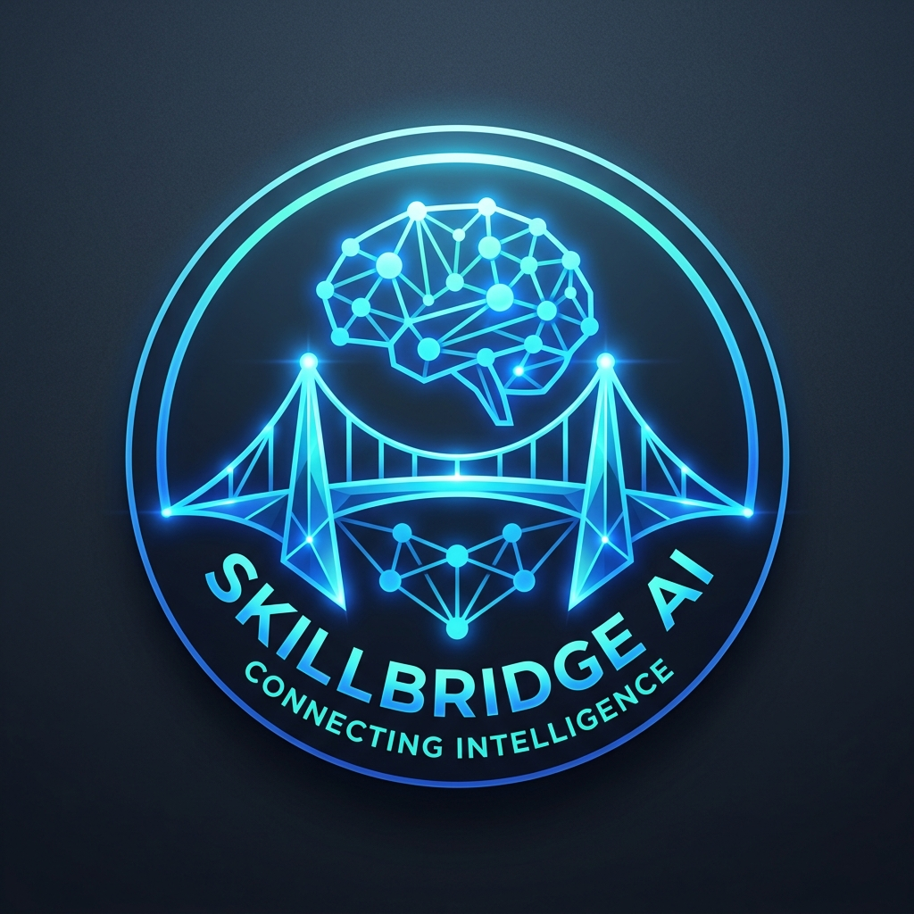
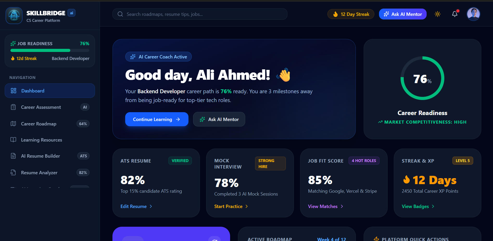
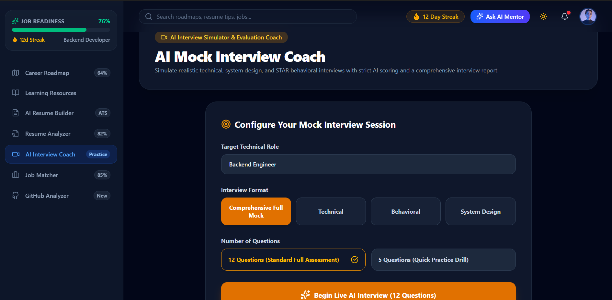
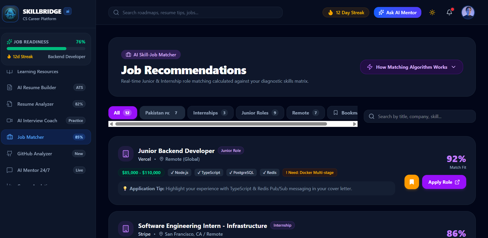
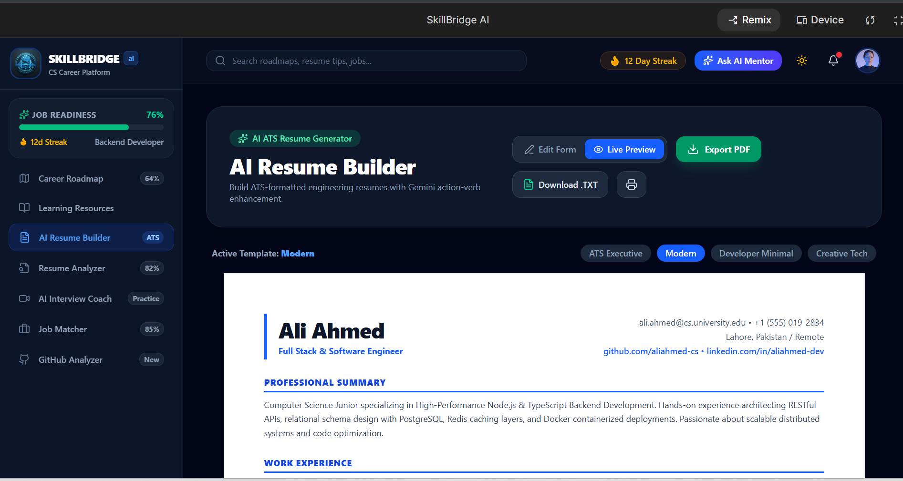

# 🚀 SkillBridge AI — AI-Powered Career Roadmap & Developer Diagnostic Platform



> **SkillBridge AI** is an intelligent, full-stack career platform that bridges the gap between computer science education and production-grade engineering standards. Powered by Google's **Gemini API**, it delivers automated diagnostic assessments, dynamic learning roadmaps, real-time AI mock interviews with voice dictation, ATS resume scanning, and AI-driven job matching — all in one place.

**🔗 Live App:** **[Launch SkillBridge AI](https://skillbridge-ai-three-zeta.vercel.app/)**

---

## 📌 Table of Contents

- [The Problem & Who It's For](#-the-problem--who-its-for)
- [Live Application](#-live-application)
- [Features](#-features)
- [The AI Feature: How It Works](#-the-ai-feature-how-it-works)
- [Tech Stack](#️-tech-stack--architecture)
- [Screenshots](#-screenshots)
- [Getting Started](#-getting-started)
- [Deployment](#-deploying-to-vercel)
- [License](#-license)

---

## 🎯 The Problem & Who It's For

**Who it's for:** Computer science students, bootcamp graduates, and early-career software engineers preparing to enter the job market.

**The problems they face:**

1. **Unstructured learning ("tutorial hell").** Students spend hundreds of hours on disconnected tutorials with no clear signal of which production-grade skills they actually need to build next.
2. **High ATS rejection rates.** A large share of entry-level engineering resumes are auto-rejected by Applicant Tracking Systems before a human ever sees them, due to missing keywords and unquantified impact statements.
3. **Interview anxiety and lack of structured feedback.** Candidates struggle to articulate technical trade-offs, system-design reasoning, and STAR-method behavioral answers under real interview pressure — and rarely get honest, specific feedback until it's too late.
4. **Blind, unfocused job applications.** Applicants spray resumes across job boards with no clear picture of their actual fit for a role or the specific gaps holding them back.

**The solution:** SkillBridge AI acts as a 24/7 personal career engineer. It diagnoses a candidate's skill level across six core engineering domains, builds a structured week-by-week roadmap toward a target role, scores and improves their resume against real ATS criteria, runs voice-enabled mock interviews with recruiter-style scorecards, and calculates precise job-fit percentages against real postings — replacing guesswork with a data-driven path to being job-ready.

---

## 🌐 Live Application

**Production:** https://skillbridge-ai-three-zeta.vercel.app/

---

## ✨ Features

### 1. 🎯 Interactive 6-Domain Skill Diagnostic
- Adaptive assessment across **Full-Stack Web, Algorithms & Data Structures, System Architecture, Databases & SQL, DevOps & Cloud,** and **AI/Machine Learning**.
- Real-time radar-chart visualization of strengths, weaknesses, and overall job-readiness score.

### 2. 🗺️ Dynamic Career Roadmap Engine
- Auto-generates a personalized, week-by-week learning plan tailored to a target role (Full-Stack, Backend, DevOps, Data Engineer, etc.).
- Interactive milestone check-offs, curated documentation links, and hands-on project suggestions.

### 3. 📄 ATS Resume Builder & AI Scanner
- Drag-and-drop resume builder with instant, ATS-safe PDF export.
- AI-powered scanner evaluates resume text for keyword density, quantified impact, formatting issues, and overall recruiter-algorithm compatibility, with a numeric score and specific fix suggestions.

### 4. 🎙️ Voice-Enabled AI Mock Interview Coach
- Simulated **technical, behavioral, and system-design** interviews with real-time follow-up questions.
- Voice dictation and text-to-speech via the Web Speech API — answer out loud or by typing.
- Generates a full recruiter scorecard (**Strong Hire / Hire / Weak Hire / No Hire**) with a downloadable PDF evaluation report.

### 5. 💼 AI Skill-Job Matcher Engine
- Analyzes job postings from international tech hubs and regional markets (including Pakistan's tech ecosystem).
- Computes a percentage fit score per posting, highlighting matched skills and specific missing competencies.

### 6. 🐙 GitHub Repository Analyzer
- Reviews a candidate's public repositories for code quality signals, commit history/consistency, documentation depth, and test coverage.

### 7. 💬 24/7 Context-Aware AI Career Mentor
- A streaming Gemini-powered chat assistant pre-loaded with the candidate's diagnostic scores and roadmap progress, so advice is always personalized rather than generic.

---

## 🤖 The AI Feature: How It Works

SkillBridge AI's intelligence layer runs on **Google's Gemini API (`gemini-3.6-flash`)**, called securely **server-side** via Node.js/Express (never exposed to the client). Every single AI call enforces **strict JSON schema output** (`responseMimeType: "application/json"`), so the model's response can be parsed and rendered directly into the UI — no free-text guesswork, no brittle regex parsing.

There are **nine** distinct AI-powered workflows, each with its own purpose-built system prompt:

### 1. 🎯 AI Career Diagnostic & Skill Assessment
Analyzes a candidate's self-assessed languages, frameworks, databases, tools, soft skills, and career goal, and returns an overall readiness score, strengths, gaps, and estimated time-to-job-readiness.
```text
You are an expert AI Career Coach for Computer Science students. Analyze the following student assessment profile and return a JSON object.

Student Profile:
- Personal Info: {personalInfo}
- Programming Languages & Confidence: {programmingSkills}
- Frameworks & Experience: {frameworks}
- Databases: {databases}
- Dev Tools: {tools}
- Soft Skills: {softSkills}
- Target Career Goal: {careerGoals.targetCareer}
- Learning Style: {learningStyle}

Return strictly valid JSON with this exact schema:
{
  "careerRecommendation": "string summary of best suited role and why",
  "overallScore": number (1-100),
  "careerReadiness": number (1-100),
  "strengths": ["string", "string"],
  "weaknesses": ["string", "string"],
  "missingSkills": ["string", "string"],
  "estimatedLearningTime": "string e.g. 4-6 Months",
  "recommendedTechnologies": ["string", "string"],
  "summary": "string overall diagnostic overview"
}
```

### 2. 🗺️ Dynamic AI Career Roadmap Generator
Generates a week-by-week, multi-month roadmap with milestones, weekly tasks, mini-projects, and a capstone scope, tailored to the target role and daily study commitment.
```text
You are an elite Tech Lead & Curriculum Director. Generate a high-yield, step-by-step career roadmap for a student aiming to become a {targetCareer}.
Current Skills: {currentSkills}
Missing / Target Skills: {missingSkills}
Study Commitment: {dailyHours} hours/day over {durationMonths} months.

Return strictly valid JSON with milestones containing weekly tasks, mini-projects, and capstone project deliverables.
```

### 3. 📄 AI Resume Bullet Enhancer
Rewrites raw resume section text into recruiter-grade bullet points with action verbs, quantified metrics, and ATS keywords.
```text
You are a Senior Tech Recruiter at Google. Enhance the following resume section text for a student targeting a {targetRole} position. Use strong action verbs, quantifiable metrics, ATS keywords, and modern bullet styling.

Section: {section}
Input Text: {rawText}

Return strictly valid JSON:
{
  "enhancedText": "string enhanced text with bullet points",
  "actionVerbsUsed": ["verb1", "verb2"],
  "atsKeywordsAdded": ["keyword1", "keyword2"],
  "improvementTips": ["tip1", "tip2"]
}
```

### 4. 🔍 AI ATS Resume Scanner & Recruiter Analyzer
Scores a full resume against a target job title across five dimensions and flags missing technical keywords.
```text
You are an expert ATS (Applicant Tracking System) Scanner & Technical Recruiter. Analyze this candidate resume for a target position: "{targetJobTitle}".

Resume Content:
{resumeContent}

Return strictly valid JSON with atsScore, grammarScore, keywordScore, formattingScore, overallReadiness, missingKeywords, and improvedSummary.
```

### 5. 🎙️ AI Mock Interview Question Generator
Generates realistic technical, behavioral (STAR), system-design, and coding questions tailored to role, domain, and difficulty.
```text
You are an AI Principal Tech Interviewer at a top tier technology firm. Generate exactly {count} distinct, realistic, high-value interview questions for a {difficulty} level interview for the target position: "{targetRole}" ({interviewType} domain).

Requirements:
1. Cover a comprehensive range of topics: core technical fundamentals, architecture/design, problem solving, STAR behavioral scenarios, and real-world trade-offs.
2. Return strictly valid JSON with an array of question objects containing hint, keyPointsToCover, and suggestedTimeMinutes.
```

### 6. 🗣️ AI Real-Time Voice/Text Answer Evaluator
Evaluates a spoken (Web Speech API) or typed interview answer in real time, with explicit scoring rules to prevent score inflation on weak answers.
```text
You are a strict, highly experienced Google/FAANG Senior Technical Interviewer evaluating a candidate for {targetRole} ({interviewType} domain).

Question Asked: "{question}"
Candidate's Answer: "{userAnswer}"

EVALUATION RULES:
1. "I DON'T KNOW" / BLANK / SKIPPED / VAGUE: If candidate answered "I don't know", "idk", "not sure", or gave a single vague sentence, score MUST be 0 - 15% with hiringRecommendation "No Hire".
2. WEAK / PARTIAL ANSWERS: If candidate answered partially or missed major technical details, score MUST be 30 - 60% with hiringRecommendation "Weak Hire".
3. STRONG ANSWERS: Only award >80% if candidate accurately addresses technical mechanics, key concepts, trade-offs, or STAR methodology with clarity.

Return strictly valid JSON with score breakdown, feedback, missingKeyPoints, modelAnswer, and hiringRecommendation.
```

### 7. 📊 Comprehensive AI Interview Recruiter Report
Aggregates an entire mock interview session into an executive report with a hiring verdict, radar metrics, and question-by-question takeaways.
```text
You are a Principal Tech Recruiter & Engineering Director. Generate a comprehensive, highly insightful Mock Interview Performance Report for a candidate applying for {targetRole} ({interviewType} format).

Questions & Candidate Evaluations:
{responses}

Return strictly valid JSON containing overallScore, hiringVerdict, skillGaps, communicationFeedback, whatToImprove, and questionSummaries.
```

### 8. 🐙 AI GitHub Profile & Code Portfolio Analyzer
Fetches live public repos via the GitHub REST API and audits the portfolio for developer rating, code quality, and ATS alignment against a target role.
```text
You are a Principal Staff Architect and Executive Recruiter performing an in-depth code & portfolio audit on GitHub handle "@{cleanUser}" for target position: "{targetRole}".

GitHub Profile Metadata & Repositories:
{repoSummaries}

IMPORTANT SCORING RULES:
1. Compute dynamic, realistic overall metrics specifically tailored to @{cleanUser}: profileRating, portfolioScore, atsScore, codeQualityScore.
2. Assign distinct, varied, and realistic scores for EACH project based on its language relevance to {targetRole}, documentation depth, stars, forks, and complexity.
3. Return strictly valid JSON with detectedLanguages, projectRatings, skillGaps, and recommendedNextProjects.
```

### 9. 💬 24/7 Context-Aware AI Career Mentor Chat
A streaming chat assistant pre-loaded with the candidate's assessment score, skills, and career goal, for personalized advice, code reviews, and interview prep.
```text
You are SkillBridge AI - an empathetic, razor-sharp, 24/7 AI Career Mentor for Computer Science students.
User Career Goal: {userContext.careerGoal}
User Level: {userContext.experienceLevel}
User Skills: {userContext.skills}

Provide direct, actionable, encouraging, and clear career advice, technical explanations, interview prep guidance, code reviews, or roadmap tips. Keep responses concise, well-structured with markdown headings or bullet points where appropriate. Be empathetic yet realistic about industry standards.
```

**Design principles used across all nine prompts:**
- Every call is scoped with a **role-specific system instruction** (recruiter, tech lead, architect, mentor, etc.) so the model stays in character and produces consistent output.
- Every call enforces **strict JSON schema output**, eliminating free-text parsing errors in the UI layer.
- Scoring prompts (e.g., the interview evaluator) include **explicit rule-based scoring bands** to prevent the model from being overly generous on weak or blank answers.
- Personalized workflows (mentor chat, diagnostic, roadmap) are **grounded in the candidate's own stored data**, so output is tailored rather than generic.

---

## 🛠️ Tech Stack & Architecture

| Category | Technology |
| :--- | :--- |
| **AI Model & SDK** | Google Gemini API — `gemini-3.6-flash` (`@google/genai`), called server-side with strict JSON schema enforcement |
| **Frontend Runtime** | React 18, TypeScript, Vite |
| **Styling & Icons** | Tailwind CSS v4, Lucide React Icons |
| **Data Visualization** | Recharts (Radar, Area & Bar visualizers) |
| **Animations** | Motion (`motion/react`) |
| **Voice & Speech** | Web Speech API (SpeechRecognition & SpeechSynthesis) |
| **PDF Generation** | jsPDF + html2canvas |
| **Backend API Server** | Node.js, Express, ESBuild |
| **Database & Persistence** | Firebase Firestore (with LocalStorage fallback) |
| **Deployment** | Google Cloud Run & Vercel Serverless |

---

## 📸 Screenshots

| Dashboard & Roadmap | AI Interview Coach |
| :---: | :---: |
|  |  |

| AI Skill-Job Matcher |
| :---: |
|  |

| AI Resume - Builder |
| :---: |
|  |


---

## ⚡ Getting Started

### Prerequisites
- **Node.js** v20.x or higher
- **npm** v9.x or higher
- **Gemini API Key** — get a free key from [Google AI Studio](https://aistudio.google.com/)

### 1. Clone & Install
```bash
git clone https://github.com/your-username/skillbridge-ai.git
cd skillbridge-ai
npm install
```

### 2. Configure Environment
Create a `.env` file in the project root:
```env
GEMINI_API_KEY=your_gemini_api_key_here
PORT=3000
```

### 3. Run the Development Server
```bash
npm run dev
```
Then open **`http://localhost:3000`** in your browser.

### 4. Build for Production
```bash
npm run build
npm start
```

---

## 🔺 Deploying to Vercel

SkillBridge AI ships pre-configured with `vercel.json` and serverless API handlers in `api/index.ts` for one-click deployment.

1. **Push to GitHub** — make sure your project is pushed to your repository.
2. **Import into Vercel** — go to the [Vercel Dashboard](https://vercel.com) → **Add New Project** → select your `skillbridge-ai` repo.
3. **Set the environment variable:**
   - Key: `GEMINI_API_KEY`
   - Value: your Gemini API key from Google AI Studio
4. **Deploy** — Vercel automatically builds the static React frontend and deploys the Express API endpoints as Serverless Functions.

---

## 📜 License

Distributed under the MIT License. Built with ❤️ for computer science students and software engineers worldwide by **SkillBridge AI**.
