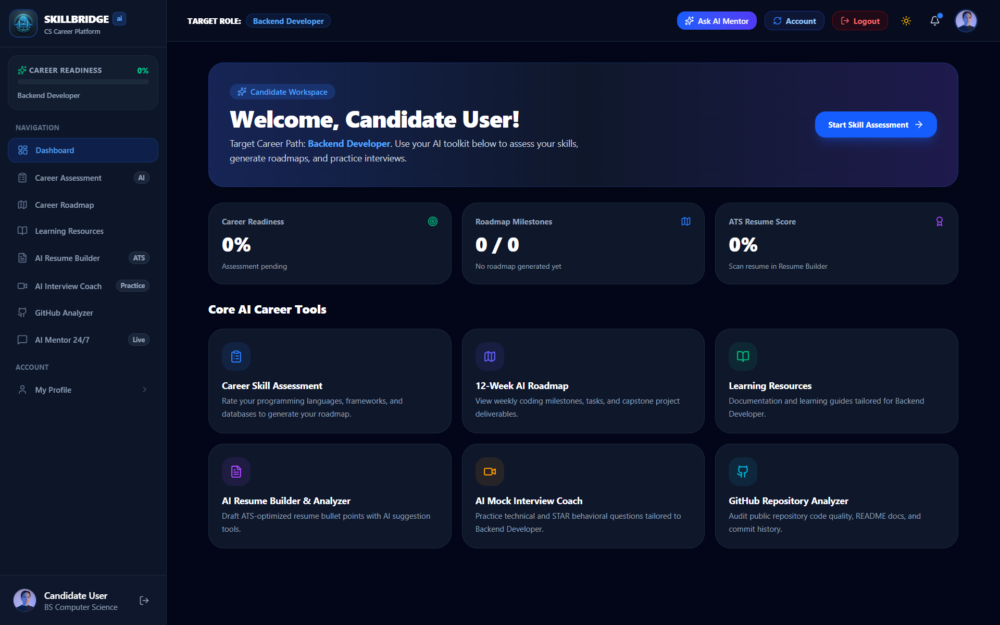
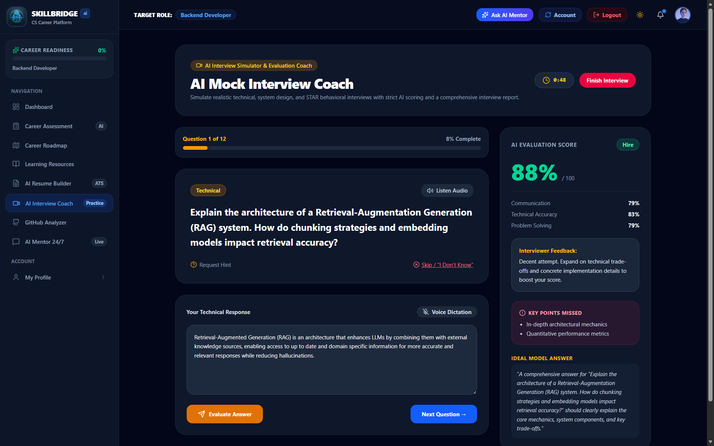
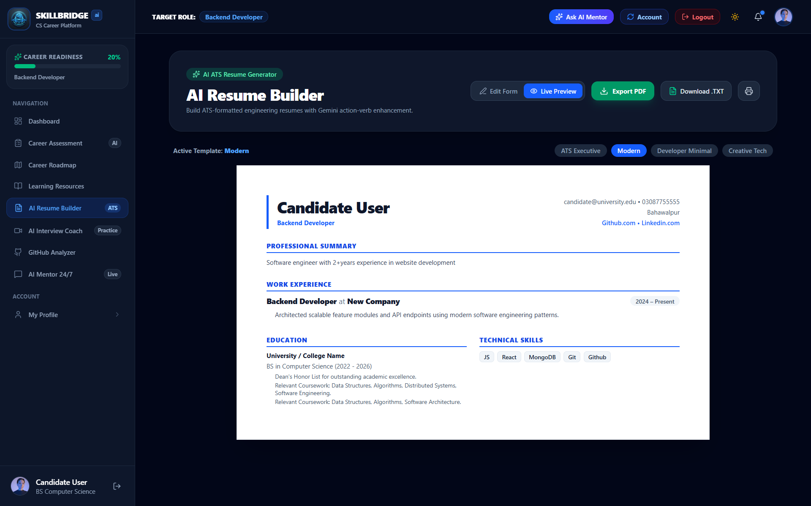

<div align="center">
  

  <h1>SkillBridge AI</h1>
  <p><strong>AI-Powered Career Guidance & Skill Engineering Platform for CS Students</strong></p>

  [](https://skillbridge-ai-three-zeta.vercel.app/)
  [](https://ai.google.dev/)
  [](https://firebase.google.com/)
  [](https://react.dev/)
</div>

---

## 🎯 What is SkillBridge AI?

**SkillBridge AI** is a comprehensive, AI-powered career guidance platform built specifically for **Computer Science students and early-career Software Engineering candidates**. 

### The Real Problem It Solves

CS students and recent graduates face a frustrating disconnect:
- They don't know **which skills** employers actually require for their target role.
- They write **generic, unoptimized resumes** that fail ATS filters.
- They have **no structured learning path** — just a sea of random tutorials.
- They walk into technical interviews **completely unprepared** for real recruiter-style questioning.

SkillBridge AI solves all of this in one place — from skill gap diagnosis to interview simulation — using Google Gemini AI to personalize every output to the candidate's specific target career role.

---

## 🌐 Live Application

**👉 [https://skillbridge-ai-three-zeta.vercel.app/](https://skillbridge-ai-three-zeta.vercel.app/)**

---

## 📸 Screenshots

### Dashboard — Personalized Career Workspace
<div align="center">
  
  <br/>
  <sub>🖥️ <em>The candidate dashboard — Career Readiness Score, Roadmap Milestones, and quick-launch AI tools personalized to the user's target role fetched from Firebase.</em></sub>
</div>

---

<div align="center">
  
  <br/>
  <sub>🎤 <em>Real-time AI interview simulation — live STAR scoring, Technical Accuracy, Key Points Missed, and an Ideal Model Answer reference for each role-specific question.</em></sub>
</div>

---

<div align="center">
  
  <br/>
  <sub>📄 <em>Multi-template ATS Resume Builder — live preview, PDF/TXT export, AI bullet point enhancement, and categorized Technical Skills across 4 professional templates.</em></sub>
</div>

---

## ✨ Full Feature List

### 🎯 Dynamic AI Career Skill Assessment
- Gemini AI generates a **role-specific technical diagnostic** (Programming Languages, Frameworks, Databases, Tools, and Soft Skills) tailored to the candidate's chosen target career role.
- Candidates rate their proficiency on each skill (0–5 scale).
- AI analyzes the full assessment, identifies **strengths, weaknesses, and missing skills**, and calculates a personalized **Career Readiness Score (0–100%)**.
- Assessment results and scores are **saved to Firebase Firestore** (`assessments/{userId}`).

### 🗺️ Assessment-Gated 12-Week AI Career Roadmap
- A customized 12-week milestone roadmap is auto-generated based on the candidate's specific **skill gaps and target role**.
- Protected by an **Assessment Gate** — candidates must complete the skill diagnostic before unlocking their roadmap.
- Interactive weekly task checkboxes track learning progress.
- Includes mini-projects, difficulty ratings, and recommended technologies.
- Roadmap progress is **persisted in Firebase Firestore** (`roadmaps/{userId}`) and reloaded on next login.

### 📄 AI Resume Builder with ATS PDF & TXT Export
- Auto pre-fills candidate details (name, email, target role, university, graduation year) from the registered profile.
- Supports adding **Work Experience** with action-verb bullet points, **Education entries** with coursework highlights, and **Technical Skills** categorized into Languages, Frameworks, Databases, and Tools.
- **AI Bullet Point Enhancer**: Rewrites work experience bullet points using Gemini AI into high-impact, quantified statements with action verbs (e.g., *"Architected a scalable REST API serving 10,000+ requests/day using Node.js and PostgreSQL"*).
- **4 ATS-friendly templates**: ATS Executive, Modern, Developer Minimal, and Creative Tech.
- One-click **Export PDF** and **Download .TXT** for ATS submission.
- Resume data is **saved to Firestore** (`resumes/{userId}`) and reloaded on login.

### 🎤 AI Mock Interview Coach & STAR Evaluator
- Realistic technical and behavioral interview simulator configured to your target role.
- Choose between **5 Questions (Quick Drill)** or **12 Questions (Full Assessment)**.
- Gemini AI asks role-specific technical questions, system design problems, and STAR-format behavioral questions.
- **Live AI evaluation** after each answer: STAR compliance score, Technical Accuracy, Communication score, Key Points Missed, and an Ideal Model Answer.
- Voice Dictation support (microphone input) and Text-to-Speech audio question reading.
- Final recruiter report with overall hire recommendation, downloadable as **PDF or TXT**.

### 🐙 GitHub Repository Analyzer
- Analyzes any public GitHub profile's repositories for code quality, architecture patterns, and technical tags.
- Generates **ATS-ready resume bullet points** for every project.
- Provides recruiter-style feedback on project scope and technical depth.

### 📚 Personalized Learning Resources
- Curated documentation links, tutorials, and courses tailored to the candidate's **target career role**.
- Resources are dynamically filtered so a "Backend Developer" sees Node.js, PostgreSQL, and Docker resources — not React tutorials.

### 💬 24/7 AI Career Mentor
- Interactive real-time chat with a career-domain-aware Gemini AI model.
- Instant advice on tech stack choices, salary negotiation scripts, resume reviews, system design concepts, and interview strategies.

### 🔒 Firebase Authentication & Cloud Firestore Persistence
- Secure **Email & Password registration and login** with full form validation.
- Forgot Password → reset email flow via Firebase Auth.
- Complete candidate registration collects: Full Name, University, Degree, Semester, Graduation Year, Target Career Role, Experience Level, GitHub URL, and LinkedIn URL.
- **"Other" custom role option** — candidates can type any role not in the dropdown.
- All candidate data (profile, assessment, roadmap, resume) is saved per user in **Cloud Firestore** and automatically reloaded on the next login session.
- **Career Readiness Score is dynamically recalculated** and synced to Firestore whenever assessment, roadmap tasks, or resume completeness changes.

### 👤 Profile Management
- Candidates can edit all their registration details from the Profile page.
- Changes are instantly synced to Firebase Firestore.
- Logout button in the navbar signs the user out of Firebase and returns to the landing page.

---

## 🤖 AI Features — Under the Hood

All AI features are powered by **Google Gemini (`gemini-2.0-flash-exp`)** via the `@google/genai` SDK running on an Express.js backend.

### System Prompt Architecture

| Feature | What Gemini Does |
|---|---|
| **Skill Assessment Generator** | Given a target role (e.g., `"Full Stack Developer"`), returns a structured JSON of role-relevant programming languages, frameworks, databases, and tools for the candidate to rate |
| **Assessment Analyzer** | Receives the full rated skill matrix and personal info → returns career readiness score, strengths, weaknesses, missing skills, recommended technologies, and a narrative career recommendation |
| **Roadmap Generator** | Takes target role + current skills + missing skills → returns a 12-week structured JSON roadmap with milestone titles, weekly tasks, mini-projects, difficulty, and estimated hours |
| **Interview Question Generator** | Given a role, generates a mix of technical theory, system design, and STAR behavioral questions at appropriate difficulty |
| **Answer Evaluator** | Receives question + candidate's answer → scores STAR compliance, technical accuracy, communication clarity, lists key points missed, and writes an ideal model answer |
| **Resume Bullet Enhancer** | Takes a raw experience bullet + target role → rewrites it with action verbs, quantification, and ATS keywords |
| **GitHub Analyzer** | Analyzes repository descriptions, languages, and topics → generates resume bullet points and recruiter feedback |
| **AI Mentor** | Role-aware conversational assistant with career guidance context |

---

## 🛠️ Technology Stack

| Layer | Technology |
|---|---|
| **Frontend** | React 18, TypeScript, Tailwind CSS v4, Lucide Icons, Vite 6 |
| **Backend / API** | Node.js, Express.js, `tsx` runtime |
| **AI Engine** | Google Gemini API (`@google/genai` SDK, `gemini-2.0-flash-exp` model) |
| **Authentication** | Firebase Authentication (Email/Password) |
| **Database** | Cloud Firestore (NoSQL — collections: `users`, `assessments`, `roadmaps`, `resumes`, `interviews`) |
| **PDF Export** | `html2canvas` + `jsPDF` |
| **Deployment** | Vercel (Frontend + Serverless API Functions) |
| **Charts** | Recharts |
| **Animations** | Motion (Framer Motion v12) |

---

## 🚀 How to Run Locally

### Prerequisites
- **Node.js** v18 or later
- A **Google Gemini API Key** (free at [ai.google.dev](https://ai.google.dev))
- A **Firebase project** with Email/Password Authentication and Firestore enabled

### 1. Clone the Repository
```bash
git clone https://github.com/SibghaFatima-22/skillbridge-ai.git
cd skillbridge-ai
```

### 2. Install Dependencies
```bash
npm install
```

### 3. Configure Environment Variables

Create a `.env.local` file in the project root:
```env
# Gemini AI
GEMINI_API_KEY=your_google_gemini_api_key_here

# Firebase (Vite exposes these to the frontend via import.meta.env)
VITE_FIREBASE_API_KEY=your_firebase_api_key
VITE_FIREBASE_AUTH_DOMAIN=your_project.firebaseapp.com
VITE_FIREBASE_PROJECT_ID=your_project_id
VITE_FIREBASE_STORAGE_BUCKET=your_project.firebasestorage.app
VITE_FIREBASE_MESSAGING_SENDER_ID=your_sender_id
VITE_FIREBASE_APP_ID=your_app_id
VITE_FIREBASE_MEASUREMENT_ID=G-XXXXXXXXXX
```

### 4. Start Development Server
```bash
npm run dev
```
Open **[http://localhost:3000](http://localhost:3000)** in your browser.

### 5. Build for Production
```bash
npm run build
```

---

## ☁️ Vercel Deployment

1. Push the repository to GitHub.
2. Import the project in [vercel.com](https://vercel.com).
3. In **Project Settings → Environment Variables**, add all `VITE_FIREBASE_*` variables and `GEMINI_API_KEY`.
4. Vercel auto-deploys on every `git push origin main`.

> **Important**: `firebase-applet-config.json` is excluded from git via `.gitignore`. Always use environment variables for credential management.

---

## 🔐 Firebase Firestore Security Rules

To enable data read/write during development, publish these rules in **Firebase Console → Firestore Database → Rules**:

```javascript
rules_version = '2';
service cloud.firestore {
  match /databases/{database}/documents {
    match /{document=**} {
      allow read, write: if true;
    }
  }
}
```

> For production, replace with proper user-scoped rules: `allow read, write: if request.auth.uid == resource.data.userId;`

---

## 📁 Project Structure

```
skillbridge-ai/
├── src/
│   ├── components/
│   │   ├── assessment/       # Career Skill Assessment Wizard
│   │   ├── auth/             # Firebase Auth Modal (Login / Register / Forgot Password)
│   │   ├── dashboard/        # Candidate Dashboard
│   │   ├── github/           # GitHub Repository Analyzer
│   │   ├── interview/        # AI Mock Interview Coach
│   │   ├── landing/          # Public Landing Page
│   │   ├── layout/           # Sidebar & Navbar
│   │   ├── mentor/           # 24/7 AI Career Mentor Chat
│   │   ├── profile/          # Candidate Profile Editor
│   │   ├── resources/        # Learning Resources
│   │   ├── resume/           # AI Resume Builder
│   │   └── roadmap/          # 12-Week Career Roadmap
│   ├── lib/
│   │   ├── api.ts            # Frontend → Backend API calls (Gemini)
│   │   ├── firebase.ts       # Firebase Auth & Firestore client
│   │   ├── firebaseSync.ts   # Firestore sync helpers & Career Readiness algorithm
│   │   └── storage.ts        # Local storage (offline fallback)
│   ├── assets/images/        # App screenshots & logo
│   └── types.ts              # TypeScript interfaces
├── server.ts                 # Express.js backend with Gemini AI endpoints
├── api-src/index.ts          # Vercel serverless function entry point
└── vercel.json               # Vercel routing config
```

---

<div align="center">
  <p>Built with ❤️ using React, Google Gemini AI, and Firebase</p>
  <p><strong>Live at: <a href="https://skillbridge-ai-three-zeta.vercel.app/">skillbridge-ai-three-zeta.vercel.app</a></strong></p>
</div>
