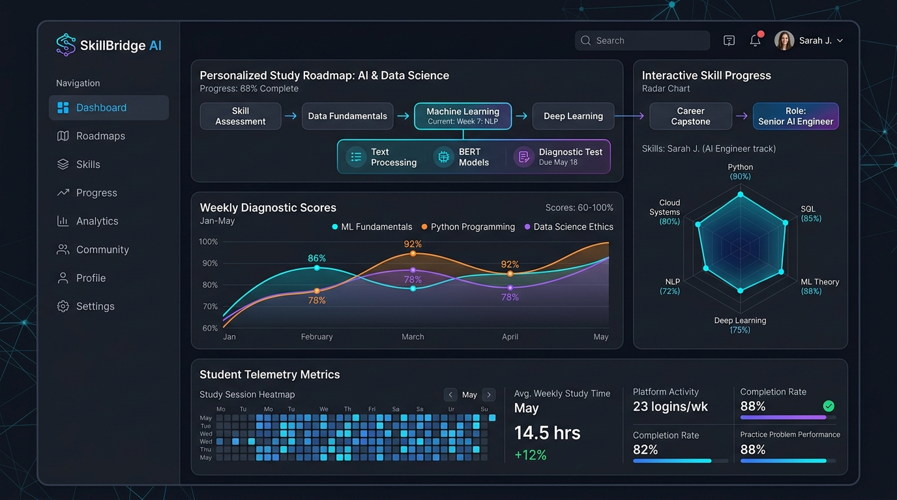
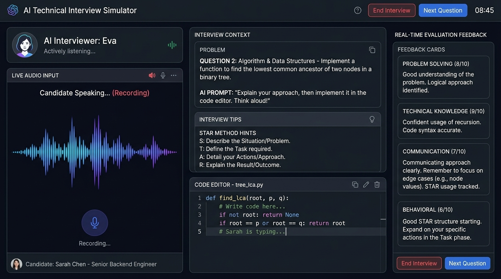
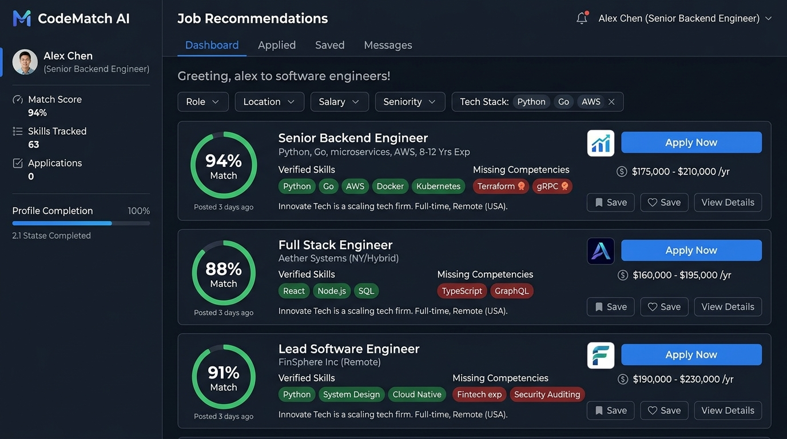

# 🚀 SkillBridge AI - AI-Powered Career Roadmap & Developer Diagnostic Platform



> **SkillBridge AI** is an intelligent full-stack career platform built to bridge the gap between computer science education and production engineering standards. Powered by Google's **Gemini API**, SkillBridge AI delivers automated diagnostic assessments, dynamic learning roadmaps, real-time AI mock interviews with voice dictation, ATS resume scanning, and job matching.

---

## 🌐 Live Application URLs

* **Live Application:** [https://ais-pre-bpbkdh7mzgpm4tvzf32iqv-699161522787.asia-southeast1.run.app](https://ais-pre-bpbkdh7mzgpm4tvzf32iqv-699161522787.asia-southeast1.run.app)
* **Development Environment:** [https://ais-dev-bpbkdh7mzgpm4tvzf32iqv-699161522787.asia-southeast1.run.app](https://ais-dev-bpbkdh7mzgpm4tvzf32iqv-699161522787.asia-southeast1.run.app)

---

## 🎯 Targeted Problem & Solution

### The Core Challenges
1. **Unstructured Learning & Tutorial Hell:** CS students spend hundreds of hours on disjointed tutorials without clear guidance on production-grade competencies.
2. **High ATS Filtering Rates:** Over 75% of entry-level engineering resumes are rejected by ATS screeners due to missing keywords and unquantified impact.
3. **Interview Preparation Anxiety:** Candidates struggle to articulate technical trade-offs, system architecture concepts, and STAR-method behavioral answers under pressure.
4. **Blind Job Applications:** Applicants spray resumes across job boards without knowing their specific skill gaps or role readiness.

### The SkillBridge AI Solution
SkillBridge AI serves as a 24/7 personal career engineer that diagnoses skill levels across 6 core domains, builds structured weekly milestones, scores resumes against ATS algorithms, conducts voice-enabled mock interviews, and calculates precise job match percentages.

---

## ✨ Core Platform Modules

### 1. 🎯 Interactive 6-Domain Skill Diagnostic
* Evaluates competencies in **Full-Stack Web**, **Algorithms & Data Structures**, **System Architecture**, **Databases & SQL**, **DevOps & Cloud**, and **AI / Machine Learning**.
* Visualizes real-time radar charts and overall job readiness vectors.

### 2. 🗺️ Dynamic Career Roadmap Engine
* Auto-generates week-by-week learning milestones tailored to target roles (*Full-Stack*, *Backend*, *DevOps*, *Data Engineer*).
* Tracks progress with interactive check-offs, documentation references, and project milestones.

### 3. 📄 ATS Resume Builder & AI Scanner
* Drag-and-drop resume builder with instant sanitized PDF export.
* **AI ATS Scanner:** Evaluates resume text against recruiter algorithms for keyword density, impact metrics, and formatting.

### 4. 🎙️ Voice-Enabled AI Mock Interview Coach
* Simulated technical, behavioral, and system design mock interviews with real-time feedback.
* **Voice Dictation & Text-to-Speech:** Candidates can dictate answers via Web Speech API or type directly, with optional audio playback.
* Generates comprehensive recruiter scorecards (*Strong Hire, Hire, Weak Hire, No Hire*) and PDF evaluation reports.

### 5. 💼 AI Skill-Job Matcher Engine
* Scrapes and analyzes job postings from international tech hubs and regional markets (including Pakistan's tech ecosystem).
* Computes percentage fit scores, highlights matching skills, and identifies missing competencies.

### 6. 🐙 GitHub Repository Analyzer
* Evaluates repository code quality, commit history, documentation depth, and test coverage.

### 7. 💬 24/7 Context-Aware AI Career Mentor
* Streaming AI assistant powered by Gemini API, pre-loaded with the candidate's diagnostic scores and roadmap progress.

---

## 🛠️ Tech Stack & Architecture

| Category | Technology |
| :--- | :--- |
| **AI Models & SDK** | Google Gemini API (`@google/genai`) |
| **Frontend Runtime** | React 18, TypeScript, Vite |
| **Styling & Icons** | Tailwind CSS v4, Lucide React Icons |
| **Data Visualization** | Recharts (Radar, Area, & Bar visualizers) |
| **Animations** | Motion (`motion/react`) |
| **Voice & Speech** | Web Speech API (SpeechRecognition & SpeechSynthesis) |
| **PDF Generation** | jsPDF + html2canvas |
| **Backend API Server** | Node.js, Express, ESBuild |
| **Database & Persistence**| Firebase Firestore (with LocalStorage fallback) |
| **Deployment** | Google Cloud Run & Vercel Serverless |

---

## 📸 Screenshots

| Dashboard & Roadmap | AI Interview Coach |
| :---: | :---: |
|  |  |

| AI Skill-Job Matcher |
| :---: |
|  |

---

## ⚡ Quickstart & Local Setup

### Prerequisites
* **Node.js**: v20.x or higher
* **npm**: v9.x or higher
* **Gemini API Key**: Obtain a free key from [Google AI Studio](https://aistudio.google.com/)

### 1. Clone & Install
```bash
git clone https://github.com/your-username/skillbridge-ai.git
cd skillbridge-ai
npm install
```

### 2. Environment Configuration
Create a `.env` file at the root:
```env
GEMINI_API_KEY=your_gemini_api_key_here
PORT=3000
```

### 3. Start Development Server
```bash
npm run dev
```
Open **`http://localhost:3000`** in your browser.

### 4. Build for Production
```bash
npm run build
npm start
```

---

## 🔺 Deploying to Vercel

SkillBridge AI is pre-configured with `vercel.json` and serverless API handlers in `api/index.ts` for 1-click deployment.

1. **Push Repository to GitHub:**
   Ensure your project is pushed to your GitHub repository.

2. **Import into Vercel:**
   - Navigate to [Vercel Dashboard](https://vercel.com) -> **Add New Project**.
   - Select your `skillbridge-ai` repository.

3. **Set Environment Variable:**
   - Key: `GEMINI_API_KEY`
   - Value: *Your Gemini API Key from Google AI Studio*

4. **Deploy:**
   Click **Deploy**. Vercel will automatically build the static React frontend and deploy Express API endpoints as Serverless Functions.

---

## 📜 License

Distributed under the MIT License. Built with ❤️ for computer science students and software engineers worldwide by **SkillBridge AI**.
